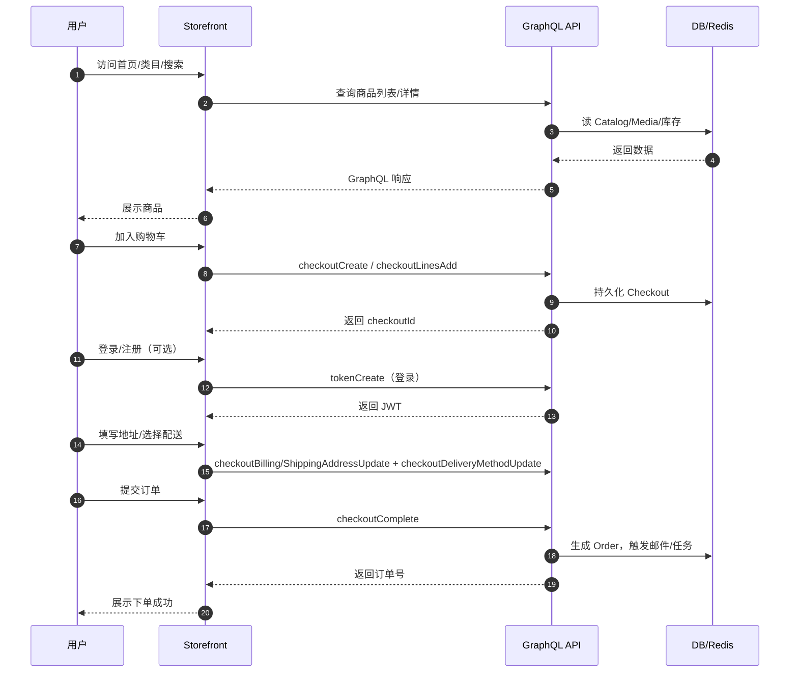
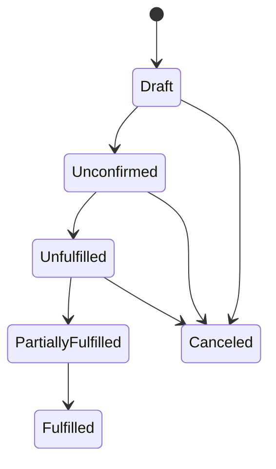
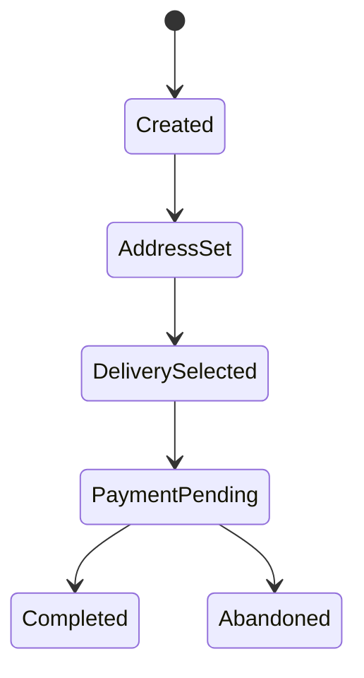

# 业务流程 · Emerge 电商 Demo

本文档梳理 Demo 的典型业务参与方、核心对象与关键流程，便于售前演示与落地评估。

## 1. 参与方（角色）
- 访客（Guest）/ 注册用户（Customer）
- 运营（Staff）/ 管理员（Admin）
- 系统服务（API、Worker、DB、缓存、邮件、APM）

## 2. 核心业务对象
- 目录：Category、Collection
- 商品：Product（SPU）、ProductVariant（SKU）、Attribute、Media、Inventory、Warehouse
- 价格与营销：Channel 定价、Promotion/Rule、Voucher、GiftCard、TaxClasses
- 交易：Checkout、Order、Payment、Fulfillment、Invoice、Shipment
- 账号与权限：User/Address、Staff/Groups/Permissions

## 3. 端到端用户流程（浏览 → 下单）

> 支付：Demo 默认不接入真实网关；如需演示支付，可启用沙箱网关（Stripe/Adyen）或使用“手动支付/模拟网关”。

## 4. 后台运营流程
### 4.1 上新与上架
1) 创建类目/集合
2) 创建商品（名称、描述、媒体、属性、SKU/库存）
3) 设置渠道与价格
4) 发布商品（可设为上架）

### 4.2 促销与活动
1) 创建 Promotion/Rule（如满减/打折）或 Voucher（优惠券）
2) 配置作用范围（商品/集合/全站）与有效期
3) 在前台验证价格展示与结算金额

### 4.3 订单处理
1) 在 Dashboard 查看新订单
2) 审核支付与库存（支付接入后）
3) 打包发货、生成发票（可选）
4) 部分/全额退款（需支付接入）

### 4.5 售后流程（退货/退款）
1) 用户发起售后（联系方式与原因）
2) 后台创建退货单/审批（如需）
3) 收货入库 → 退款（原路或线下）
4) 关闭售后单并通知用户
### 4.4 基础配置步骤（首次部署后建议）
1) 创建/检查渠道与默认币种
2) 配置运输区域与运费（至少 1 个方法）
3) 配置税类与税率策略（含/不含税）
4) 新建仓库并为 SKU 分配库存
5) （可选）安装支付 App 并填入沙箱密钥

## 5. 简化状态机
- 订单：Draft → Unconfirmed → Unfulfilled → PartiallyFulfilled → Fulfilled → Canceled
- 支付：NotCharged → Preauthorized → Charged → Refunded → Cancelled（与网关联动）
- 促销：Active / Inactive（规则生效即时影响价格计算）

## 6. 观测与邮件
- 观测：APM（Jaeger）追踪 API/任务链路；容器日志
- 邮件：Mailpit 捕获注册、下单、重置密码等邮件，便于测试

## 7. Demo 演示脚本（建议）
1) 登录 Dashboard，快速展示商品/订单/促销配置能力
2) 在前台搜索商品，查看类目与详情页
3) 加入购物车，填地址选择配送，提交订单
4) 返回 Dashboard 查看新订单，展示“运营 → 用户闭环”

## 8. 状态图（Mermaid）
### 8.1 订单

### 8.2 Checkout

## 9. RACI & SLA（对外参考）
- R：实施工程师（部署/集成）、运营（基础配置）
- A：项目负责人（里程碑与验收）
- C：客户技术/安全评审
- I：销售与交付管理
- 演示环境服务可用：工作时间 99.5%，恢复目标（RTO）≤ 2h

## 10. 角色与权限（示例映射）
- Admin：全量权限
- Operator（运营）：商品/促销/订单管理，无系统配置
- Support（客服）：订单查看、退货退款操作、用户查找
- Viewer：只读
